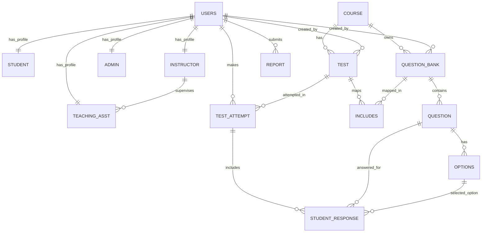

# Online Test System Project Report

## Table of Contents

- Abstract
- Chapter 1: Introduction
  - 1.1 Background
  - 1.2 Need for the System
  - 1.3 Scope
  - 1.4 Existing vs Proposed System
  - 1.5 Report Organization
- Chapter 2: Problem Statement and Objectives
  - 2.1 Problem Statement
  - 2.2 Functional Objectives
  - 2.3 Non-Functional Objectives
  - 2.4 Constraints and Assumptions
  - 2.5 Objective to Module Mapping
- Chapter 3: Methodology
  - 3.1 Development Approach
  - 3.2 Requirement Analysis
  - 3.3 System Architecture
  - 3.4 Module Design
  - 3.5 Workflow Design
  - 3.6 Security Design
  - 3.7 Testing Methodology
- Chapter 4: ER Diagram and Relational Tables with Sample Data
  - 4.1 ER Diagram
  - 4.2 Relationship Explanations
  - 4.3 Relational Schema
  - 4.4 Data Dictionary
  - 4.5 Sample Data
  - 4.6 Normalization Notes
- Chapter 5: DDL Commands and SQL Procedures, Functions, Triggers
  - 5.1 DDL Overview
  - 5.2 Table Creation Scripts
  - 5.3 Constraint Strategy
  - 5.4 Stored Procedures
  - 5.5 Triggers
  - 5.6 Practical Query Scenarios
- Chapter 6: Results and Snapshots
  - 6.1 Module-wise Results
  - 6.2 API Result Samples
  - 6.3 Snapshot Checklist
  - 6.4 Test Case Summary
- Chapter 7: Conclusion, Limitations, and Future Work
  - 7.1 Conclusion
  - 7.2 Limitations
  - 7.3 Future Work
- Chapter 8: References
- Appendix A: API Endpoint Catalog
- Appendix B: Role Permission Matrix
- Appendix C: Glossary

---

## Abstract

The Online Test System is a full stack web application designed to digitize and streamline the academic assessment process. It enables institutions and instructors to create courses, organize question banks, construct objective tests, and evaluate student performance with immediate scoring and analytics. The system supports four distinct user roles: student, instructor, teaching assistant, and administrator. Role-based access control is enforced at both the user interface layer and the backend API layer.

The frontend is implemented using React and Axios, while the backend is built using Node.js and Express. Persistent data management is handled by MySQL with a normalized relational schema. Authentication is implemented with JSON Web Tokens and password hashing is performed using bcryptjs. The system includes operational modules for registration and login, course and question management, test scheduling, student attempts, result retrieval, leaderboard generation, and issue reporting.

A key contribution of this project is the end-to-end mapping of academic workflow into measurable software modules. Instructors can build reusable question banks and include one or multiple banks in a test. Students can attempt only active tests and receive immediate result summaries. Administrators can monitor users, tests, and submitted reports. Analytical endpoints provide test-level and student-level insights, helping academic stakeholders make better decisions.

The project demonstrates practical implementation of role-aware workflows, transactional data handling, relational integrity through foreign keys, and service-oriented API design. It provides a strong baseline for future enhancements such as objective and subjective hybrid assessments, proctoring, notifications, and cloud-scale deployment.

---

## Chapter 1: Introduction

### 1.1 Background

Educational institutions increasingly rely on digital platforms for teaching, learning, and evaluation. Traditional examination systems often involve manual operations such as paper setting, invigilation, and result compilation, which are time-consuming and error-prone. Web-based test systems address these pain points by automating test delivery, response collection, scoring, and reporting.

The Online Test System developed in this project addresses these needs by implementing a role-driven platform where different stakeholders can perform role-specific tasks. Instructors can define test content, students can participate in online assessments, and administrators can oversee platform usage.

### 1.2 Need for the System

The following operational challenges motivate the project:

1. Manual test creation and distribution overhead.
2. Delays in evaluation and publication of scores.
3. Difficulty in managing a large pool of questions.
4. Inconsistent access control across different user categories.
5. Limited visibility into performance trends.
6. Lack of centralized issue reporting for exam-related problems.

The proposed system offers structured digital workflows for all these areas.

### 1.3 Scope

The implementation scope includes:

1. User registration and login.
2. Role-aware access control.
3. Course creation and listing.
4. Question bank creation by course.
5. MCQ question and option management.
6. Test creation with schedule window and bank inclusion.
7. Student test start and submit workflow.
8. Automated scoring and result retrieval.
9. Leaderboard and analytics endpoints.
10. Report submission and admin resolution.

Out-of-scope items for this version:

1. Subjective answer evaluation.
2. Live remote proctoring.
3. Payment or subscription management.
4. Multi-tenant institutional onboarding.
5. Distributed microservices deployment.

### 1.4 Existing vs Proposed System

| Criteria | Existing Manual/Basic Process | Proposed Online Test System |
|---|---|---|
| Test creation | Manual, repetitive | Structured and reusable via banks |
| Question reuse | Limited | High reuse through question banks |
| Access control | Weak or ad hoc | Role-based, API enforced |
| Evaluation | Manual or delayed | Immediate automated scoring |
| Visibility | Low | Analytics and leaderboards |
| Issue tracking | Informal | Built-in report module |
| Administrative control | Fragmented | Centralized user and test controls |

### 1.5 Report Organization

This report is organized into eight chapters. Chapter 2 defines problem and objectives, Chapter 3 explains implementation methodology, Chapter 4 documents data model and relational structure, Chapter 5 covers SQL-level implementation details, Chapter 6 presents outcomes with snapshot planning and test evidence, and Chapter 7 and 8 conclude with future direction and references.

### Chapter 1 Summary

This chapter introduced the motivation, scope, and value proposition of the Online Test System. The project shifts examination workflows from manual handling to an integrated, role-based digital platform.

---

## Chapter 2: Problem Statement and Objectives

### 2.1 Problem Statement

Institutions require a reliable digital mechanism to conduct online tests while maintaining role-based control, data consistency, and timely result generation. Existing processes are often fragmented, involve significant manual intervention, and provide weak analytical visibility. A unified platform is needed that can support secure authentication, reusable assessment content, scheduled test delivery, automated scoring, and administrative oversight.

### 2.2 Functional Objectives

1. Register and authenticate users with secure credentials.
2. Assign and enforce role-specific permissions.
3. Create and manage course records.
4. Create question banks for specific courses.
5. Add MCQ questions with exactly one correct option.
6. Create tests and link them to one or multiple question banks.
7. Allow students to attempt active tests.
8. Validate submitted answers and compute scores.
9. Provide student result views and attempt history.
10. Provide leaderboard and statistics for academic roles.
11. Allow all users to submit issue reports.
12. Allow administrators to manage users, tests, and reports.

### 2.3 Non-Functional Objectives

1. Security: hashed passwords and token-based authentication.
2. Data integrity: foreign keys and transactional operations.
3. Usability: single dashboard with role-aware sections.
4. Maintainability: modular controllers and routes.
5. Performance: direct SQL access with indexed keys.
6. Reliability: explicit validation and error responses.

### 2.4 Constraints and Assumptions

Constraints:

1. MySQL is the target RDBMS.
2. Backend follows monolithic Node.js architecture.
3. Test responses currently support objective questions only.
4. Deployment and production hardening are not part of this iteration.

Assumptions:

1. Users provide valid registration details.
2. JWT secret and database environment variables are configured.
3. Instructor-created test windows are correctly set.
4. Network connectivity exists between frontend and backend.

### 2.5 Objective to Module Mapping

| Objective | Module | Implementation Evidence |
|---|---|---|
| Secure login | Auth | JWT-based login, bcrypt comparison |
| Role access control | Middleware | Token verification and role authorization |
| Assessment content management | Course, Bank, Question | Dedicated create/list APIs |
| Scheduled test lifecycle | Test, Attempt | Start and submit flow with time checks |
| Automated scoring | Attempt, Response | Correct option validation and score update |
| Administrative governance | Admin controls | User delete/promote, test delete, report resolve |
| Analytics visibility | Analytics | Leaderboard, student performance, test stats |

### Chapter 2 Summary

This chapter established the central problem and translated it into implementable objectives. The defined goals map directly to backend modules and frontend workflows implemented in the project.

---

## Chapter 3: Methodology

### 3.1 Development Approach

The project follows a modular and iterative approach. Core features were implemented in vertical slices from UI to API to database. Each module was designed as a clear contract:

1. Route layer receives requests and applies middleware.
2. Controller layer validates input and executes SQL.
3. Database enforces integrity via schema constraints.
4. Frontend invokes APIs and reflects role-specific behavior.

### 3.2 Requirement Analysis

Requirements were grouped into:

1. Authentication and session needs.
2. Academic content management needs.
3. Student attempt and evaluation needs.
4. Administrative and support needs.
5. Observability and analytics needs.

Role-driven requirement decomposition ensured that each workflow could be isolated and validated independently.

### 3.3 System Architecture

The architecture is a three-tier web model:

1. Presentation tier: React pages, protected routes, and role-aware dashboard sections.
2. Application tier: Express server with route modules, controllers, middleware.
3. Data tier: MySQL schema with foreign key dependencies.

Request flow:

1. User action on frontend.
2. Axios request to API.
3. JWT validation and role authorization.
4. Controller-level validation.
5. SQL execution with optional transaction.
6. JSON response to frontend.
7. UI update and feedback.

### 3.4 Module Design

#### 3.4.1 Authentication Module

- Registration supports role-specific profile records.
- Login returns signed JWT with role and user identifier.
- Middleware verifies token and guards protected routes.

#### 3.4.2 Academic Setup Module

- Course creation by instructor/admin.
- Question bank creation by course.
- Question insertion with options and correctness rules.

#### 3.4.3 Test Management Module

- Test creation with duration and start/end times.
- Mapping tests to banks through bridge table.
- Retrieval of available tests and test details.

#### 3.4.4 Attempt and Evaluation Module

- Student starts test if window is active.
- Questions and options are fetched for included banks.
- Submission validates question-option consistency.
- Score is computed and persisted.

#### 3.4.5 Analytics Module

- Top leaderboard by test.
- Global leaderboard across tests.
- Student-level performance summary.
- Test-level statistical summary.

#### 3.4.6 Reporting and Administration Module

- Report creation by authenticated users.
- Report review and resolution by admins.
- User and test administration operations.

### 3.5 Workflow Design

#### 3.5.1 Registration and Login Flow

1. User selects role and submits registration data.
2. System creates USERS row.
3. System creates role-specific profile row.
4. User logs in with email and password.
5. Backend returns token and role context.
6. Frontend stores session and opens dashboard.

#### 3.5.2 Test Creation Flow

1. Instructor selects course.
2. Instructor creates one or more question banks.
3. Instructor inserts MCQ items in banks.
4. Instructor creates test with timing and selected banks.
5. Mapping records are inserted into INCLUDES.

#### 3.5.3 Test Attempt and Submission Flow

1. Student fetches available tests.
2. Student starts selected test.
3. System creates or resumes active attempt.
4. System sends question and option payload.
5. Student submits answers.
6. Backend validates each answer relation.
7. Score and response records are committed.
8. Student views result summary.

### 3.6 Security Design

1. Password hashing with bcryptjs.
2. JWT token verification for protected APIs.
3. Role-based authorization checks per route.
4. Input validation in controllers.
5. Database-level referential integrity.
6. Restriction of destructive actions by role.

### 3.7 Testing Methodology

Testing strategy includes:

1. API path validation for each role.
2. Positive and negative case checks on major endpoints.
3. Validation of schedule constraints for tests.
4. Validation of score calculation and result retrieval.
5. Admin operation checks for user/test/report management.

### Chapter 3 Summary

This chapter outlined how requirements were translated into modular architecture and workflows. The implementation emphasizes correctness, role safety, and database integrity.

---

## Chapter 4: ER Diagram and Relational Tables with Sample Data

### 4.1 ER Diagram



### 4.2 Relationship Explanations

1. USERS to STUDENT, INSTRUCTOR, ADMIN, TEACHING_ASST is one-to-one specialization.
2. INSTRUCTOR to TEACHING_ASST is one-to-many via assigned instructor id.
3. COURSE to QUESTION_BANK is one-to-many.
4. QUESTION_BANK to QUESTION is one-to-many.
5. QUESTION to OPTIONS is one-to-many.
6. COURSE to TEST is one-to-many.
7. TEST to QUESTION_BANK is many-to-many through INCLUDES.
8. TEST to TEST_ATTEMPT is one-to-many.
9. TEST_ATTEMPT to STUDENT_RESPONSE is one-to-many with composite key control.
10. USERS to REPORT is one-to-many.

### 4.3 Relational Schema

| Table | Primary Key | Foreign Keys | Purpose |
|---|---|---|---|
| USERS | user_id | None | Master user identity |
| STUDENT | user_id | user_id -> USERS | Student profile extension |
| INSTRUCTOR | user_id | user_id -> USERS | Instructor profile extension |
| ADMIN | user_id | user_id -> USERS | Admin profile extension |
| TEACHING_ASST | user_id | user_id -> USERS, assigned_instructor -> INSTRUCTOR | TA profile and mapping |
| COURSE | course_id | None | Course catalog |
| QUESTION_BANK | bank_id | course_id -> COURSE, created_by -> USERS | Bank of questions |
| QUESTION | question_id | bank_id -> QUESTION_BANK | Question items |
| OPTIONS | option_id | question_id -> QUESTION | MCQ options |
| TEST | test_id | course_id -> COURSE, created_by -> USERS | Test schedule and metadata |
| INCLUDES | (test_id, bank_id) | test_id -> TEST, bank_id -> QUESTION_BANK | Test-bank bridge |
| TEST_ATTEMPT | attempt_id | student_id -> USERS, test_id -> TEST | Student attempt header |
| STUDENT_RESPONSE | (attempt_id, question_id) | attempt_id -> TEST_ATTEMPT, question_id -> QUESTION, selected_option_id -> OPTIONS | Per-question answer |
| REPORT | report_id | user_id -> USERS | User-reported issue |

### 4.4 Data Dictionary

#### USERS

| Column | Type | Constraint | Description |
|---|---|---|---|
| user_id | INT | PK, AUTO_INCREMENT | Unique user id |
| name | VARCHAR(150) | NOT NULL | Full name |
| email | VARCHAR(190) | UNIQUE, NOT NULL | Login email |
| password | VARCHAR(255) | NOT NULL | Hashed password |
| role | ENUM | NOT NULL | student, instructor, teaching_asst, admin |
| created_at | TIMESTAMP | DEFAULT CURRENT_TIMESTAMP | Creation time |

#### STUDENT

| Column | Type | Constraint | Description |
|---|---|---|---|
| user_id | INT | PK, FK | References USERS |
| reg_no | VARCHAR(64) | UNIQUE, NOT NULL | Registration number |
| sem | VARCHAR(20) | NULL | Semester |
| dept | VARCHAR(120) | NULL | Department |

#### INSTRUCTOR

| Column | Type | Constraint | Description |
|---|---|---|---|
| user_id | INT | PK, FK | References USERS |
| dept | VARCHAR(120) | NULL | Department |
| designation | VARCHAR(120) | NULL | Job title |

#### ADMIN

| Column | Type | Constraint | Description |
|---|---|---|---|
| user_id | INT | PK, FK | References USERS |
| admin_level | INT | NOT NULL DEFAULT 1 | Admin level |
| privileges | VARCHAR(255) | NULL | Privilege metadata |

#### TEACHING_ASST

| Column | Type | Constraint | Description |
|---|---|---|---|
| user_id | INT | PK, FK | References USERS |
| assigned_instructor | INT | FK, NOT NULL | References INSTRUCTOR |

#### COURSE

| Column | Type | Constraint | Description |
|---|---|---|---|
| course_id | INT | PK, AUTO_INCREMENT | Course id |
| course_name | VARCHAR(190) | NOT NULL | Course title |
| course_code | VARCHAR(50) | UNIQUE, NOT NULL | Course code |
| created_at | TIMESTAMP | DEFAULT CURRENT_TIMESTAMP | Creation time |

#### QUESTION_BANK

| Column | Type | Constraint | Description |
|---|---|---|---|
| bank_id | INT | PK, AUTO_INCREMENT | Bank id |
| course_id | INT | FK, NOT NULL | Parent course |
| created_by | INT | FK, NOT NULL | Creator user id |
| title | VARCHAR(190) | NOT NULL | Bank title |
| description | TEXT | NOT NULL | Bank description |
| created_at | TIMESTAMP | DEFAULT CURRENT_TIMESTAMP | Creation time |

#### QUESTION

| Column | Type | Constraint | Description |
|---|---|---|---|
| question_id | INT | PK, AUTO_INCREMENT | Question id |
| bank_id | INT | FK, NOT NULL | Parent bank |
| question_text | TEXT | NOT NULL | Question statement |
| difficulty_level | VARCHAR(50) | NOT NULL | easy/medium/hard |
| marks | INT | NOT NULL DEFAULT 1 | Marks weight |
| created_at | TIMESTAMP | DEFAULT CURRENT_TIMESTAMP | Creation time |

#### OPTIONS

| Column | Type | Constraint | Description |
|---|---|---|---|
| option_id | INT | PK, AUTO_INCREMENT | Option id |
| question_id | INT | FK, NOT NULL | Parent question |
| option_text | TEXT | NOT NULL | Option text |
| is_correct | TINYINT(1) | NOT NULL DEFAULT 0 | Correctness flag |

#### TEST

| Column | Type | Constraint | Description |
|---|---|---|---|
| test_id | INT | PK, AUTO_INCREMENT | Test id |
| course_id | INT | FK, NOT NULL | Linked course |
| title | VARCHAR(190) | NOT NULL | Test title |
| total_marks | INT | NOT NULL DEFAULT 0 | Total marks |
| duration | INT | NOT NULL DEFAULT 0 | Duration in minutes |
| start_time | DATETIME | NOT NULL | Start datetime |
| end_time | DATETIME | NOT NULL | End datetime |
| created_by | INT | FK, NOT NULL | Creator user id |
| created_at | TIMESTAMP | DEFAULT CURRENT_TIMESTAMP | Creation time |

#### INCLUDES

| Column | Type | Constraint | Description |
|---|---|---|---|
| test_id | INT | PK, FK | Linked test |
| bank_id | INT | PK, FK | Linked bank |

#### TEST_ATTEMPT

| Column | Type | Constraint | Description |
|---|---|---|---|
| attempt_id | INT | PK, AUTO_INCREMENT | Attempt id |
| student_id | INT | FK, NOT NULL | Student user id |
| test_id | INT | FK, NOT NULL | Test id |
| start_time | DATETIME | NOT NULL DEFAULT CURRENT_TIMESTAMP | Attempt start |
| end_time | DATETIME | NULL | Attempt submission time |
| score | INT | NOT NULL DEFAULT 0 | Final score |

#### STUDENT_RESPONSE

| Column | Type | Constraint | Description |
|---|---|---|---|
| attempt_id | INT | PK, FK | Parent attempt |
| question_id | INT | PK, FK | Question answered |
| selected_option_id | INT | FK, NOT NULL | Chosen option |
| is_correct | TINYINT(1) | NOT NULL DEFAULT 0 | Correctness outcome |
| created_at | TIMESTAMP | DEFAULT CURRENT_TIMESTAMP | Response time |

#### REPORT

| Column | Type | Constraint | Description |
|---|---|---|---|
| report_id | INT | PK, AUTO_INCREMENT | Report id |
| user_id | INT | FK, NOT NULL | Reporter |
| role | ENUM | NOT NULL | Reporter role |
| report_type | ENUM | NOT NULL DEFAULT issue | bug/complaint/issue/feedback |
| title | VARCHAR(255) | NOT NULL | Report title |
| description | TEXT | NOT NULL | Report details |
| status | ENUM | NOT NULL DEFAULT pending | pending/resolved |
| created_at | TIMESTAMP | DEFAULT CURRENT_TIMESTAMP | Created time |

### 4.5 Sample Data

#### USERS Sample

| user_id | name | email | role |
|---|---|---|---|
| 1 | Alice Student | alice@example.com | student |
| 2 | Bob Instructor | bob@example.com | instructor |
| 3 | Carol Admin | carol@example.com | admin |

#### COURSE Sample

| course_id | course_name | course_code |
|---|---|---|
| 101 | Database Systems | CS501 |
| 102 | Operating Systems | CS502 |
| 103 | Computer Networks | CS503 |

#### QUESTION_BANK Sample

| bank_id | course_id | created_by | title |
|---|---|---|---|
| 201 | 101 | 2 | DBMS Unit 1 |
| 202 | 101 | 2 | DBMS Unit 2 |
| 203 | 102 | 2 | OS Scheduling |

#### QUESTION Sample

| question_id | bank_id | difficulty_level | marks |
|---|---|---|---|
| 301 | 201 | easy | 1 |
| 302 | 201 | medium | 2 |
| 303 | 202 | hard | 3 |

#### OPTIONS Sample

| option_id | question_id | option_text | is_correct |
|---|---|---|---|
| 401 | 301 | SQL stands for Structured Query Language | 1 |
| 402 | 301 | SQL stands for Standard Question Logic | 0 |
| 403 | 301 | SQL stands for Sequential Queue Layer | 0 |

#### TEST Sample

| test_id | course_id | title | total_marks | duration |
|---|---|---|---|---|
| 501 | 101 | DBMS Mid Quiz | 20 | 30 |
| 502 | 102 | OS Practice Test | 25 | 40 |
| 503 | 103 | CN Unit Test | 15 | 25 |

#### TEST_ATTEMPT Sample

| attempt_id | student_id | test_id | score |
|---|---|---|---|
| 601 | 1 | 501 | 15 |
| 602 | 1 | 502 | 18 |
| 603 | 1 | 503 | 12 |

#### REPORT Sample

| report_id | user_id | report_type | title | status |
|---|---|---|---|---|
| 701 | 1 | issue | Timer mismatch | pending |
| 702 | 2 | bug | Duplicate bank display | resolved |
| 703 | 1 | feedback | Better review page | pending |

### 4.6 Normalization Notes

The schema is largely normalized to third normal form:

1. Master user identity is separated from role-specific profile details.
2. Course, bank, question, and option are decomposed by ownership and dependency.
3. Many-to-many relation between tests and banks is resolved through INCLUDES.
4. Attempt header and response detail are separated for transactional integrity.

### Chapter 4 Summary

This chapter documented the data model comprehensively using ER representation, relational schemas, field definitions, and representative data examples.

---

## Chapter 5: DDL Commands and SQL Procedures, Functions, Triggers

### 5.1 DDL Overview

The project uses MySQL DDL executed during backend initialization. The database and core tables are created if they do not already exist. This ensures first-run bootstrap without manual schema setup.

### 5.2 Key DDL Commands

Representative examples from implementation:

```sql
CREATE TABLE IF NOT EXISTS USERS (
  user_id INT AUTO_INCREMENT PRIMARY KEY,
  name VARCHAR(150) NOT NULL,
  email VARCHAR(190) NOT NULL UNIQUE,
  password VARCHAR(255) NOT NULL,
  role ENUM('student', 'instructor', 'teaching_asst', 'admin') NOT NULL,
  created_at TIMESTAMP DEFAULT CURRENT_TIMESTAMP
);
```

```sql
CREATE TABLE IF NOT EXISTS COURSE (
  course_id INT AUTO_INCREMENT PRIMARY KEY,
  course_name VARCHAR(190) NOT NULL,
  course_code VARCHAR(50) NOT NULL UNIQUE,
  created_at TIMESTAMP DEFAULT CURRENT_TIMESTAMP
);
```

```sql
CREATE TABLE IF NOT EXISTS TEST_ATTEMPT (
  attempt_id INT AUTO_INCREMENT PRIMARY KEY,
  student_id INT NOT NULL,
  test_id INT NOT NULL,
  start_time DATETIME NOT NULL DEFAULT CURRENT_TIMESTAMP,
  end_time DATETIME DEFAULT NULL,
  score INT NOT NULL DEFAULT 0,
  CONSTRAINT fk_attempt_student FOREIGN KEY (student_id) REFERENCES USERS(user_id) ON DELETE CASCADE,
  CONSTRAINT fk_attempt_test FOREIGN KEY (test_id) REFERENCES TEST(test_id) ON DELETE CASCADE
);
```

```sql
CREATE TABLE IF NOT EXISTS STUDENT_RESPONSE (
  attempt_id INT NOT NULL,
  question_id INT NOT NULL,
  selected_option_id INT NOT NULL,
  is_correct TINYINT(1) NOT NULL DEFAULT 0,
  created_at TIMESTAMP DEFAULT CURRENT_TIMESTAMP,
  PRIMARY KEY (attempt_id, question_id),
  CONSTRAINT fk_response_attempt FOREIGN KEY (attempt_id) REFERENCES TEST_ATTEMPT(attempt_id) ON DELETE CASCADE,
  CONSTRAINT fk_response_question FOREIGN KEY (question_id) REFERENCES QUESTION(question_id) ON DELETE CASCADE,
  CONSTRAINT fk_response_option FOREIGN KEY (selected_option_id) REFERENCES OPTIONS(option_id) ON DELETE CASCADE
);
```

### 5.3 Constraint Strategy

1. Primary keys for unique row identity.
2. Composite keys for bridge and response uniqueness.
3. Foreign keys to enforce cross-table validity.
4. ON DELETE CASCADE for dependent transactional data.
5. ON DELETE RESTRICT where ownership transfer should be explicit.

### 5.4 Procedures

The project includes MySQL stored procedures in SQL scripts. They are not Oracle PL/SQL procedures, but they provide equivalent procedural database logic.

#### Procedure: GetStudentPerformance

Purpose:

- Fetch attempt history and context for a student.

Input:

- p_student_id INT

Output:

- Attempt rows with student, test, and course metadata.

Example call:

```sql
CALL GetStudentPerformance(1);
```

#### Procedure: GetLeaderboard

Purpose:

- Fetch top performers for a given test.

Input:

- p_test_id INT

Output:

- Top 5 ranked rows by score and submission time.

Example call:

```sql
CALL GetLeaderboard(501);
```

#### Procedure: GetTestStats

Purpose:

- Aggregate total attempts, average score, max score, and min score.

Input:

- p_test_id INT

Output:

- One summary row grouped by test and course.

Example call:

```sql
CALL GetTestStats(501);
```

### 5.5 Triggers

#### Trigger: set_default_status

Type: BEFORE INSERT ON REPORT

Purpose:

- Force report status as pending during insertion.

Effect:

- New report rows start in pending state.

#### Trigger: trg_student_response_before_insert (script)

Type: BEFORE INSERT ON STUDENT_RESPONSE

Purpose:

- Auto-compute response correctness based on selected option.

#### Trigger: trg_student_response_after_insert (script)

Type: AFTER INSERT ON STUDENT_RESPONSE

Purpose:

- Recompute attempt score from correct responses.

Note: The backend controller also computes correctness and score explicitly during submission. In production, trigger and app-layer logic should be harmonized to avoid duplicate scoring semantics.

### 5.6 Practical Query Scenarios

#### Scenario 1: Find available tests now

```sql
SELECT test_id, title, duration, total_marks, start_time, end_time
FROM TEST
WHERE NOW() BETWEEN start_time AND end_time
ORDER BY start_time ASC;
```

Expected output:

- List of currently active tests that students can attempt.

#### Scenario 2: Get submitted attempts leaderboard for a test

```sql
SELECT ta.attempt_id, ta.student_id, u.name AS student_name, ta.score
FROM TEST_ATTEMPT ta
INNER JOIN USERS u ON u.user_id = ta.student_id
WHERE ta.test_id = 501
  AND ta.end_time IS NOT NULL
ORDER BY ta.score DESC, ta.end_time ASC
LIMIT 5;
```

Expected output:

- Ranked top five submitted attempts.

### Chapter 5 Summary

This chapter presented the schema creation strategy, constraints, procedural SQL artifacts, and practical query patterns used by the system.

---

## Chapter 6: Results and Snapshots

### 6.1 Module-wise Results

#### 6.1.1 Authentication

- Registration supports all roles.
- Login validates credentials and issues JWT.
- Protected routes reject missing or invalid token.

Result: Secure role-aware session handling achieved.

#### 6.1.2 Course and Question Bank Management

- Instructor/admin can create courses.
- Instructor/admin can create banks per course.

Result: Reusable academic structure achieved.

#### 6.1.3 Question and Options

- Instructor/TA/admin can add questions with options.
- Validation enforces minimum option count and exactly one correct option.

Result: Reliable MCQ input integrity achieved.

#### 6.1.4 Test Lifecycle

- Instructor/admin can create timed tests and link banks.
- Students can see only active tests.

Result: Controlled test availability achieved.

#### 6.1.5 Attempt and Submission

- Student starts attempt within active window.
- Submission validates question-option consistency.
- Score and answer counts returned in response.

Result: End-to-end digital evaluation achieved.

#### 6.1.6 Analytics

- Role-authorized users can view leaderboard and stats.
- Student performance endpoint provides attempt summary and history.

Result: Performance visibility achieved.

#### 6.1.7 Reporting and Admin

- All users can submit report entries.
- Admin can resolve reports and manage users/tests.

Result: Operational governance achieved.

### 6.2 API Result Samples

#### Login Success Sample

```json
{
  "success": true,
  "message": "Login successful.",
  "token": "<jwt>",
  "user_id": 1,
  "role": "student"
}
```

#### Start Test Sample

```json
{
  "success": true,
  "message": "Test started successfully.",
  "data": {
    "attempt_id": 601,
    "test": {
      "test_id": 501,
      "title": "DBMS Mid Quiz"
    },
    "questions": []
  }
}
```

#### Submit Test Sample

```json
{
  "success": true,
  "message": "Test submitted successfully.",
  "data": {
    "attempt_id": 601,
    "score": 15,
    "total_marks": 20,
    "correct_answers": 8,
    "wrong_answers": 2
  }
}
```

#### Result Sample

```json
{
  "success": true,
  "data": {
    "attempt_id": 601,
    "test_id": 501,
    "score": 15,
    "total_marks": 20,
    "correct_answers": 8,
    "wrong_answers": 2,
    "total_answered": 10
  }
}
```

#### Leaderboard Sample

```json
{
  "success": true,
  "data": {
    "test_id": 501,
    "total_ranked": 5,
    "leaderboard": []
  }
}
```

### 6.3 Snapshot Checklist

| Screen | What to Capture | Why It Matters | Suggested Caption |
|---|---|---|---|
| Login Page | Email/password form and error handling | Demonstrates auth entry point | Login interface with validation feedback |
| Registration Page | Role dropdown and TA instructor field | Shows role-aware onboarding | Registration with dynamic role inputs |
| Dashboard Overview | Role card, live tests count | Highlights role-tailored UI | Dashboard overview for active session |
| Course Management | Course creation and listing | Shows academic setup | Course module with create and select flow |
| Question Bank Module | Bank create form and bank list | Shows reusable content layer | Question bank creation by course |
| Question Module | Question form and options | Shows MCQ data entry | Question authoring with correctness selection |
| Test Module | Test create form and bank linking | Shows test assembly | Test scheduling and bank inclusion |
| Test Attempt Page | Question navigation and options | Shows student exam experience | Student test attempt interface |
| Result Page | Score and correct/wrong summary | Shows evaluation output | Immediate result summary after submission |
| Analytics Section | Leaderboard and test stats | Shows monitoring capability | Analytics and ranking dashboard |
| Admin Users | Delete and promote actions | Shows governance operations | User administration controls |
| Admin Reports | Report list and resolve action | Shows support workflow | Report resolution panel |

### 6.4 Test Case Summary

| Test Case ID | Scenario | Expected Result | Actual Result | Status |
|---|---|---|---|---|
| TC-01 | Login with valid credentials | Token issued and dashboard access | As expected | Pass |
| TC-02 | Login with invalid password | Unauthorized response | As expected | Pass |
| TC-03 | Student accessing instructor API | Forbidden response | As expected | Pass |
| TC-04 | Create question with no correct option | Validation error | As expected | Pass |
| TC-05 | Start test before start_time | Error indicating not started | As expected | Pass |
| TC-06 | Submit answers with mismatched option | Validation error | As expected | Pass |
| TC-07 | Fetch result for submitted attempt | Score summary returned | As expected | Pass |
| TC-08 | Admin resolve report | Status becomes resolved | As expected | Pass |

### Chapter 6 Summary

This chapter verified module outcomes and provided practical evidence formats including API samples, test cases, and screenshot planning for final documentation.

---

## Chapter 7: Conclusion, Limitations, and Future Work

### 7.1 Conclusion

The Online Test System successfully implements a complete role-based online examination workflow from onboarding to evaluation and governance. The project demonstrates strong alignment between frontend experience, backend business logic, and relational data modeling. Major achievements include:

1. Secure authentication and authorization.
2. Structured question and test lifecycle.
3. Automated score generation and result retrieval.
4. Analytics support for academic roles.
5. Administrative controls for users, tests, and reports.

The implementation is practical for institutional pilot usage and provides a robust base for iterative enhancement.

### 7.2 Limitations

1. Current question model is objective-only (MCQ).
2. No anti-cheating or proctoring features.
3. No distributed architecture for high-scale concurrency.
4. Limited real-time notifications and messaging.
5. No advanced observability stack for production diagnostics.
6. Mobile-first optimization can be improved further.

### 7.3 Future Work

Short-term:

1. Add pagination and filtering for admin and analytics tables.
2. Add export options for results and leaderboards.
3. Introduce richer validation and form-level hints.

Mid-term:

1. Add subjective question support and evaluator workflow.
2. Add test pause and resume policies.
3. Add notifications for test availability and report resolution.

Long-term:

1. Introduce proctoring and suspicious activity detection.
2. Add institution-level multi-tenant support.
3. Deploy with containerized scaling and managed cloud database.
4. Add recommendation analytics for personalized learning support.

### Chapter 7 Summary

The project meets core objectives and is deployment-ready for controlled usage. Future iterations can expand assessment depth, integrity mechanisms, and scalability.

---

## Chapter 8: References

1. React Documentation. https://react.dev
2. React Router Documentation. https://reactrouter.com
3. Axios Documentation. https://axios-http.com
4. Node.js Documentation. https://nodejs.org
5. Express Documentation. https://expressjs.com
6. MySQL Reference Manual. https://dev.mysql.com/doc
7. JSON Web Tokens Introduction. https://jwt.io/introduction
8. bcryptjs Package Documentation. https://www.npmjs.com/package/bcryptjs
9. MDN Web Docs for HTTP Status Codes and REST semantics. https://developer.mozilla.org
10. OWASP Cheat Sheet Series, Authentication and Session Management. https://cheatsheetseries.owasp.org

### Chapter 8 Summary

This chapter listed foundational technical references used for architecture, implementation, and security alignment.

---

## Appendix A: API Endpoint Catalog

| Method | Endpoint | Access Role | Purpose |
|---|---|---|---|
| POST | /api/auth/register | Public | Register user |
| POST | /api/auth/login | Public | Login and token issuance |
| GET | /api/auth/users | Admin | List users |
| DELETE | /api/auth/users/:user_id | Admin | Delete user |
| PATCH | /api/auth/users/:user_id/promote | Admin | Promote TA to instructor |
| POST | /api/course | Instructor/Admin | Create course |
| GET | /api/course | Auth optional in implementation | List courses |
| POST | /api/question-bank | Instructor/Admin | Create question bank |
| GET | /api/question-bank/:course_id | Auth optional in implementation | List banks by course |
| POST | /api/question | Instructor/Admin/TA | Add question with options |
| GET | /api/questions/by-bank/:bank_id | Authenticated | List questions by bank |
| POST | /api/test | Instructor/Admin | Create test |
| GET | /api/test/available | Authenticated | Get active tests |
| GET | /api/test/:course_id | Instructor/Admin/TA | Get tests by course |
| GET | /api/test/details/:test_id | Instructor/Admin/TA | Get complete test detail |
| GET | /api/test/all | Admin | Get all tests |
| DELETE | /api/test/:test_id | Admin | Delete test |
| POST | /api/test/start/:test_id | Student | Start attempt |
| POST | /api/test/submit/:attempt_id | Student | Submit attempt |
| GET | /api/test/result/:attempt_id | Student | Fetch attempt result |
| GET | /api/analytics/leaderboard/:test_id | Instructor/Admin/TA | Test leaderboard |
| GET | /api/analytics/leaderboard-global | Instructor/Admin/TA | Global leaderboard |
| GET | /api/analytics/student/:student_id | Student/Instructor/Admin/TA | Student performance |
| GET | /api/analytics/test/:test_id | Instructor/Admin/TA | Test stats |
| POST | /api/report | Any authenticated role | Submit report |
| GET | /api/report | Admin | List reports |
| PUT | /api/report/:id | Admin | Mark report resolved |

---

## Appendix B: Role Permission Matrix

| Capability | Student | Instructor | Teaching Assistant | Admin |
|---|---|---|---|---|
| Login/Register | Yes | Yes | Yes | Yes |
| Create course | No | Yes | No | Yes |
| Create question bank | No | Yes | No | Yes |
| Add questions | No | Yes | Yes | Yes |
| Create tests | No | Yes | No | Yes |
| Attempt tests | Yes | No | No | No |
| View own results | Yes | No | No | No |
| View analytics | Limited own performance | Yes | Yes | Yes |
| Manage users | No | No | No | Yes |
| Manage all tests | No | No | No | Yes |
| Submit report | Yes | Yes | Yes | Yes |
| Resolve report | No | No | No | Yes |

---

## Appendix C: Glossary

- API: Application Programming Interface.
- JWT: JSON Web Token for stateless authentication.
- RBAC: Role-Based Access Control.
- MCQ: Multiple Choice Question.
- FK: Foreign Key.
- PK: Primary Key.
- DDL: Data Definition Language.
- Trigger: Database procedure invoked by table events.
- Leaderboard: Ranked list of top test scores.
- Attempt: A student session for a specific test.

---

## Final Note for Submission Expansion

To reach a strict 30 plus page academic format in Word:

1. Add screenshot images listed in Chapter 6.
2. Add architecture and sequence diagrams in Chapter 3.
3. Expand each table explanation with 3 to 5 paragraphs.
4. Add endpoint-by-endpoint request and response examples in Appendix A.
5. Add sample SQL execution screenshots for Chapter 5.

This document is the complete technical base draft built from your project implementation.
